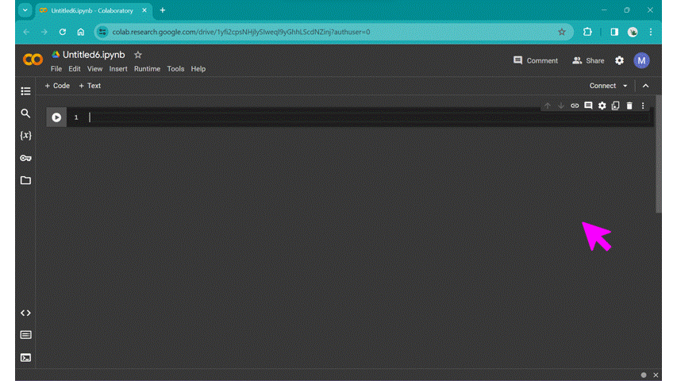

# Building your first plot

Before we delve a little deeper into some of the concepts we introduced in the previous section with regards to what makes a graphic "good", let's lay the foundations and build our first plot. You need a draft to start improving on it!

In this course, we are going to be using a cloud-based development environment, so you don't have to install anything locally on your machine.

In this session, we are going to work step-by-step through building a basic plot. The full self-contained example script is given at the end of this page. 

```{admonition} Tip
:class: tip

It's a good idea to type the example code out in your notebook as opposed to copying and pasting. This will help you get used to the syntax and will allow you to improve your skills more rapidly.

```

## Introduction to the tools we are using

For this course, we are going to be using a particular tool for interacting with Python called a "Notebook". You may have heard of the Jupyter Notebook before: this is a document format that includes snippets of formatted text, embedded executable/runnable code, and the output of said code (for example, plots/figures). We are going to be using an online version of Jupyter Notebooks hosted by Google, called [Google Colaboratory](https://colab.google/); the free version provides plenty compute power for this tutorial.

| | 
|:-:| 
| Click "New Notebook" to create a fresh file. *Alt text: gif of Google Colab's landing page, showing the "New Notebook" button being clicked.* |

Open up a new notebook for this session: click "New Notebook", then give the new file a sensible name. In a Python Notebook, you can create two different types of cells: a text cell, which can contain markdown-formatted text, and code cells, where you put Python code and can run it.

| | 
|:-:| 
| Hover the cursor over the bottom edge of the cell to show the options for a new text cell or code cell. *Alt text: gif of Google Colab's new notebook page, showing the new text cell and new code cell menu.* |

Try out the classic first program, "Hello World" from the first code cell, and click the run cell button to the left of the cell, or use the keyboard shortcut Ctrl + Enter:

```
print("Hello World!")
```

The first cell may take a while to run as Colab connects to the runtime, but shortly it should output `Hello World!` below your first code cell.

### Some useful keyboard shortcuts

| Action | Shortcut |
| :--- | :--- |
| Create new code cell | Ctrl + M B |
| Execute code cell | Shift + Enter |

## Refresher on the Python ecosystem

One of the pre-requisites for this course is some basic Python experience, but don't worry if you've forgotten how things work. For this course, we will be *importing* a variety of different libraries. Do this in the first cell of your notebook:

```
import matplotlib.pyplot
import numpy
```

When we use a *function* from one of these libraries, we need to prefix it with the module name, for example `numpy.loadtxt()`. 
In this course, we will be using some common shortened names/aliases for libraries, that saves us typing out the full name everytime we use them. You can replace the above code snippet with this:

```
import matplotlib.pyplot as plt
import numpy as np
```

The example `numpy.loadtxt()` above would now be instead written `np.loadtxt()`.

## Create some example data

In the next section of this course, we will run through how to load real data in in a variety of different ways. For this initial example, we are going to quickly generate some example data.

## How do I initialise a basic figure?

## How do I save this figure to my machine?

## What next...