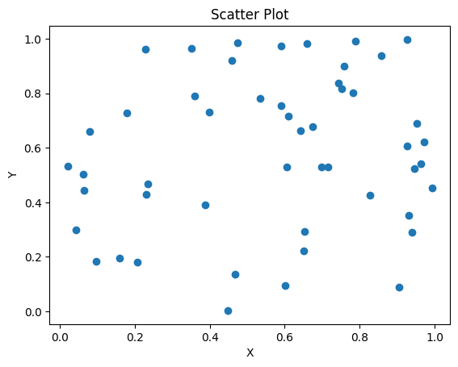
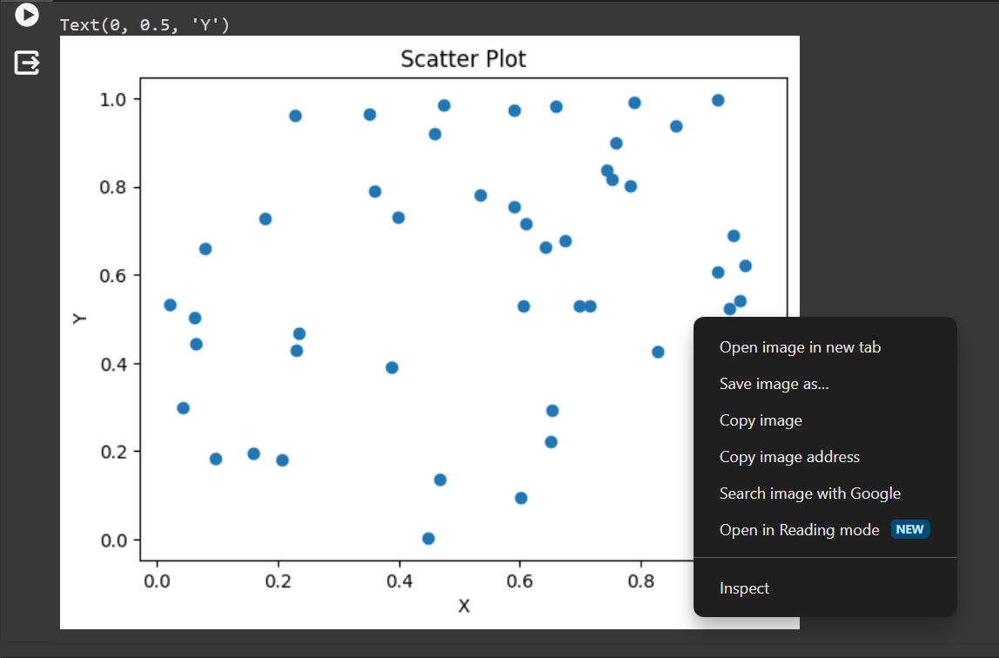

# Building your first plot

Before we delve a little deeper into some of the concepts we introduced in the previous section with regards to what makes a graphic "good", let's lay the foundations and build our first plot. You need a draft to start improving on it!

In this course, we are going to be using a cloud-based development environment, so you don't have to install anything locally on your machine.

In this session, we are going to work step-by-step through building a basic plot. The full self-contained example script is given at the end of this page. 

```{admonition} Tip
:class: tip

It's a good idea to type the example code out in your notebook as opposed to copying and pasting. This will help you get used to the syntax and will allow you to improve your skills more rapidly.

```

## Introduction to the tools we are using

For this course, we are going to be using a particular tool for interacting with Python called a "Notebook". You may have heard of the Jupyter Notebook before: this is a document format that includes snippets of formatted text, embedded executable/runnable code, and the output of said code (for example, plots/figures). We are going to be using an online version of Jupyter Notebooks hosted by Google, called [Google Colaboratory](https://colab.google/); the free version provides plenty compute power for this tutorial.

| | 
|:-:| 
| Click "New Notebook" to create a fresh file. *Alt text: gif of Google Colab's landing page, showing the "New Notebook" button being clicked.* |

Open up a new notebook for this session: click "New Notebook", then give the new file a sensible name. In a Python Notebook, you can create two different types of cells: a text cell, which can contain markdown-formatted text, and code cells, where you put Python code and can run it.

| | 
|:-:| 
| Hover the cursor over the bottom edge of the cell to show the options for a new text cell or code cell. *Alt text: gif of Google Colab's new notebook page, showing the new text cell and new code cell menu.* |

Try out the classic first program, "Hello World" from the first code cell, and click the run cell button to the left of the cell, or use the keyboard shortcut Ctrl + Enter:

```
print("Hello World!")
```

The first cell may take a while to run as Colab connects to the runtime, but shortly it should output `Hello World!` below your first code cell.

### Some useful keyboard shortcuts

| Action | Shortcut |
| :--- | :--- |
| Create new code cell | Ctrl + M B |
| Execute code cell | Shift + Enter |

## Refresher on the Python ecosystem

One of the pre-requisites for this course is some basic Python experience, but don't worry if you've forgotten how things work. For this course, we will be *importing* a variety of different libraries. Do this in the first cell of your notebook:

```
import matplotlib.pyplot
import numpy
```

When we use a *function* from one of these libraries, we need to prefix it with the module name, for example `numpy.loadtxt()`. 
In this course, we will be using some common shortened names/aliases for libraries, that saves us typing out the full name every time we use them. You can replace the above code snippet with this:

```
import matplotlib.pyplot as plt
import numpy as np
```

The example `numpy.loadtxt()` above would now be instead written `np.loadtxt()`.

## Create some example data

In the next section of this course, we will run through how to load real data in in a variety of different ways. For this initial example, we are going to quickly generate some example data. Let's assume we want to create a **scatter plot** with 50 pairs of (x, y) data. Let's write some code that will generate 50 random numbers between zero and one.

```
# Create random x and y data

x = np.random.rand(50)
y = np.random.rand(50)
```

```{admonition} Tip
:class: tip

You can add comments to your code using the \# symbol; this text is skipped over when you tell the code to run; it is just for you or anyone else who reads your code to better understand what you are doing.

```

You can take a closer look at what this has produced by executing a cell that only contains `x` or `y`, or `print(x)`, `print(y)` (what is the difference between `x` and `print(x)` in terms of output?).


## How do I initialise a basic figure?

So you have your data and you want to build a scatter plot to see if there's any relationship between x and y. 

To create a plot in Python, we will always follow a few key steps.

First, we initialise the figure and the axes. The `figure` object can be thought of as the page you draw your plot onto. The `ax` object is the box drawn by the x and y axes, the "panel" your plot will be drawn in.

```
# Create a figure and axes objects

fig, ax = plt.subplots()
```

The `subplots` function has the prefix `plt` because it's from the `matplotlib.pyplot` library that we loaded early and assigned the shortened name `plt`.
If you run this code, you should get an empty figure that looks something like this:

| | 
|:-:| 
| Empty axes without any data plotted. *Alt text: white rectangle area surrounded by x and y axes, with labels from 0-1 on both. No data points are plotted.* |

You can change the size of the `fig` object using the `figsize` argument; this takes inches by default.

```
# Create a figure and axes, and set the figure size
fig, ax = plt.subplots(figsize=(7, 4))
```


## How do I plot my data?

In this example, we are creating a very simple scatter plot using the (x, y) pairs we created earlier. We can use the `matplotlib` `scatter` function to do this:

```
# Plot the data
ax.scatter(x, y)
```

The prefix `ax` before `.scatter` tells this function that the scatter plot is to be drawn on the axes you set up earlier. We'll later look at how this works for a multipart figure where you have a number of different panels/axes showing different things. This will produce a basic scatter plot using the default `matplotlib` aesthetic settings; it should look something like the figure below.

| | 
|:-:| 
| Basic scatterplot with no labels or title. *Alt text: white rectangle area surrounded by x and y axes, with labels from 0-1 on both. Random data is plotted as large blue dots.* |

```{admonition} But I've seen/used *plt.scatter(x,y)* before... what's the difference?
:class: dropdown
In Matplotlib, there are two different approaches to making a plot.
One is *object oriented* and the other is *procedural*...
Essentially, these two terms are used to describe different programming languages and how they approach handling variables, data, and functions.

In general, Python is an *object oriented* programming language, which means it uses *objects* to get things done; in the code snippets above, the `fig` object is the box where everything relating to the plot goes, the `ax` object is a smaller box inside this that takes everything relating to that one panel of the plot. Because this is the approach taken in the Python language in general, this is the approach we will take as it helps to keep things consistent.

In contrast, the popular scientific programming language *Matlab* uses a procedural approach to plotting figures. *Matplotlib* was designed to emulate this, to allow users to swap to Python; this means you can *also* create plots without ever initialising a `fig` or `ax` object explicitly. This is an completely valid approach, but to avoid confusion we will be sticking to the *object oriented* way of plotting in this course.

Do not worry if this doesn't make sense - the key take-away is that when searching through examples or reading other people's code, you may see things done in a way that looks very similar, but uses subtly different function names - this is why! 

If you're interested and want to learn more, [this](https://neuraldatascience.io/4-viz/proc_vs_oo.html#procedural-versus-object-oriented-plotting-in-matplotlib) is a good starting point.
```

## How do I add labels?

Plots like this do not convey the required information unless they have axes labels. Since this is not real data, we can just call the values on the x-axis "X" and the values on the y-axis "Y" - we don't have any units to add.

```
# Set title and labels
ax.set_title('Scatter Plot')
ax.set_xlabel('X')
ax.set_ylabel('Y')
```

| | 
|:-:| 
| Basic scatterplot with axes labels and a title. *Alt text: a scatter plot of random data with both x and y in the range [0, 1]; data is represented by blue dots. The figure title reads "Scatter Plot".* |

You've just made your very first plot with Python!

## How do I save this figure to my machine?

There are a number of different ways to save a plot out of Google Colab.

| | 
|:-:| 
| Right click on the output figure to save it to your machine. *Alt text: a screenshot of the context menu after right-clicking your output figure, including the option to "Save image as..."* |

You can just right click/control-click the output image and either select "Save image as..." as shown in the above screenshot, or copy the output to a Powerpoint or similar. This option does not let you control resolution or image format.

Alternatively, you can use the `savefig` function to save the output:

```
fig.savefig("your_figure_name_goes_here.png")
```

If you add this to your code and run it, you can access the saved file from the files menu on the left of the screen (the folder symbol).

| | 
|:-:| 
| Use the files menu to access figures saved during the runtime. *Alt text: a gif showing how to navigate to the saved file via the files menu on the left of the screen.* |

```{admonition} Tip
:class: tip

Files saved here are only accessible while your virtual machine is up and running - once you close Colab, Google kills the machine you were using and everything you had saved is wiped. If you want your figure to survive, make sure to download them - or just accept that you need to replot them when you want them again!

```

## What next...

You save your figure, but the resolution isn't what you need - you want to use it in a presentation and when you add it to your slideshow, it looks pixelated and low-quality. How do we do this? Well, let's have our first look at the official Matplotlib documentation!

[Here's the documentation](https://matplotlib.org/stable/api/_as_gen/matplotlib.pyplot.savefig.html) for the `savefig` function. What can we learn from this?

We're shown a little code-snippet called the call signature:

```
savefig(fname, *, transparent=None, dpi='figure', format=None,
        metadata=None, bbox_inches=None, pad_inches=0.1,
        facecolor='auto', edgecolor='auto', backend=None,
        **kwargs
       )
```

This essentially shows us all the possible options we can *pass* to the `savefig` function. These are called *arguments*. The first option, `fname` is what we passed before, when we entered `"your_figure_name_goes_here.png"`. This is a required argument: the `savefig` function won't work without it. All the other arguments are *optional*, and have defaults assigned with equals, for example `dpi='figure'`. This means that the dpi or dots-per-inch (a measure of resolution) is set to a default value for the figure (100 dpi by default in Matplotlib). If we scroll down past the call signature code snippet, we can see all the different arguments and a description for each. For `dpi`, 

> **dpi : float or 'figure', default:** `rcParams["savefig.dpi"]` **(default:** `'figure'`**)**
> The resolution in dots per inch. If 'figure', use the figure's dpi value.

This essentially tells you what we explain above, that the default value is set by the figure, which unless you have changed something, Matplotlib sets to 100 dpi (which you can find in the documentation for the `figure` object [here](https://matplotlib.org/stable/api/_as_gen/matplotlib.pyplot.figure.html)). It also tells you that `dpi` can be set to a float value (such as 10.0, 300, 473.5 etc.) or to the default `'figure'`. Assignment is done using an equals sign. Note, all optional arguments can be excluded from the function call:

```
savefig(fname, dpi=some_number_here
       )
```

```{admonition} Challenge
Change the dpi and size of your figure to allow it to be printed on a poster as a high-quality 10 inch $\times$ 10 inch square. What dpi is recommended for printing? How do dpi and figure size interact?
```

```{admonition} Challenge
Save the figure in a *vector* format such as a `.pdf` or `.svg` instead of a `.png`. How might the `dpi` value work when saving a vector format image?
```

## Scatter plot template

This code snippet plots a scatter plot in a figure that's 7 $\times$ 4 inches, with a dpi of 300, in png format.

```
# Import the required libraries
import matplotlib.pyplot as plt
import numpy as np

# Create random x and y data

x = np.random.rand(50)
y = np.random.rand(50)

# Create a figure and axes, and set the figure size in inches
fig, ax = plt.subplots(figsize=(7, 4))

# Plot the data as a scatter plot
ax.scatter(x, y)

# Set title and labels
ax.set_title('Scatter Plot')
ax.set_xlabel('X')
ax.set_ylabel('Y')

# Save the figure
fig.savefig("figure_name.png", dpi=300)
```