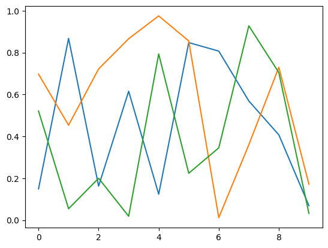
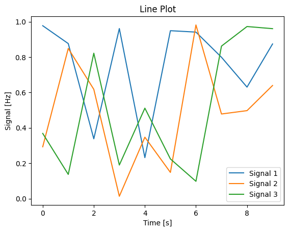

# Making comparisons: line plots

A basic line plot is a simple yet powerful tool to display changes over a continuous interval or time period. It's a great choice for tracking trends and patterns, making it invaluable in a variety of research fields. While the default settings in many plotting libraries, including Matplotlib, provide a quick and easy way to generate a line plot, they may not always be the optimal choice.

In this session, we are going to build a basic line plot with randomly generated data, and discuss how best to tweak features such as linestyle and colour to make the figure more readable and effective.


```{admonition} Tip
:class: tip

It's a good idea to type the example code out in your notebook as opposed to copying and pasting. This will help you get used to the syntax and will allow you to improve your skills more rapidly.

```

## Part 1: building a plot using the default settings

We're going to start off by building a plot using the default settings provided by `matplotlib`, then discuss why these might not always be the best option.

### Creating some random example data

In the same way we did for the previous scatter plot, we are going to create some random example data to populate our line plot. First, we need to import `matplotlib.pyplot` and `numpy`, as we did in the previous example. Use the dropdown hint if you are stuck.

```{admonition} Import the required libraries
:class: dropdown
Import `matplotlib` and `numpy` as you did in your first plot:

`import matplotlib.pyplot as plt`

`import numpy as np`
```

Instead of creating a list of x data with corresponding y values, we are going to create some time series data.

First, we will create the variable `time`, which will vary from 0 - 10 seconds in 1 s intervals; then we will create 3 "signal" variables which will be lists of associated random numbers at each time (also 10 values):

```
# create example random data
time = np.arange(10)
signal_1 = np.random.rand(10)
signal_2 = np.random.rand(10)
signal_3 = np.random.rand(10)
```

Check what these different variables look like by running a cell containing either just the variable name, or `print(variable_name)`.

### Initialise your figure

This is the exact same as for the scatter plot in the last session:

```
# Create a figure and axes objects

fig, ax = plt.subplots()
```

This will be the starting point for almost all of your plots, unless you are doing ery unusual gridded layouts.

### Plot your data

Now, instead of plotting the `(x, y)` random pairs using the `scatter` function as
we did in the previous plot, we are instead going to plot the pairs `(time, signal_1)`, `(time, signal_2)` and `(time, signal_3)` using the `plot` function:

```
ax.plot(time, signal_1)
ax.plot(time, signal_2)
ax.plot(time, signal_3)
```

When you run this code, you will notice that `matplotlib` automatically assigns a different colour to each line so that the different series can be differentiated if you add a legend. It should look something like this:

| | 
|:--| 
| A simple lineplot without legend, axes labels or a title. *Alt text: A lineplot with three series shown in orange, green and blue lines. X values increase from 0&ndash;10, while y values for each series vary randomly between 0&ndash;1.* |

This plot now needs axes labels and a legend. We're going to pretend that this data represents some sort of signals recorded, who's frequency (unit = Hertz) changed over time (unit = seconds).
Add labels as you did previously:

```
# Set title and labels
ax.set_title('Line Plot')
ax.set_xlabel('Time [s]')
ax.set_ylabel('Signal [Hz]')
```

In order to add a legend, we need to first label the data by adding `label="data name"` into the *arguments* of the `plot` function:

```
# Scatter plot
ax.plot(time, signal_1, label="Signal 1")
ax.plot(time, signal_2, label="Signal 2")
ax.plot(time, signal_3, label="Signal 3")
```

Then, we can call the `legend` function which automatically collects any labelled objects in the axes and displays them:

```
# Add a legend
ax.legend()
```

| | 
|:--| 
| A simple lineplot with a legend, axes labels and a title. *Alt text: A lineplot with three series shown in orange, green and blue lines. X values increase from 0&ndash;10, while y values for each series vary randomly between 0&ndash;1. The x-axis is labelled "Time [s]" and the y-axis is labelled "Frequency [Hz]".* |

Note that `matplotlib` attempts to estimate the best placement for the legend *object* so that it is overlapping the least number of datapoints possible.