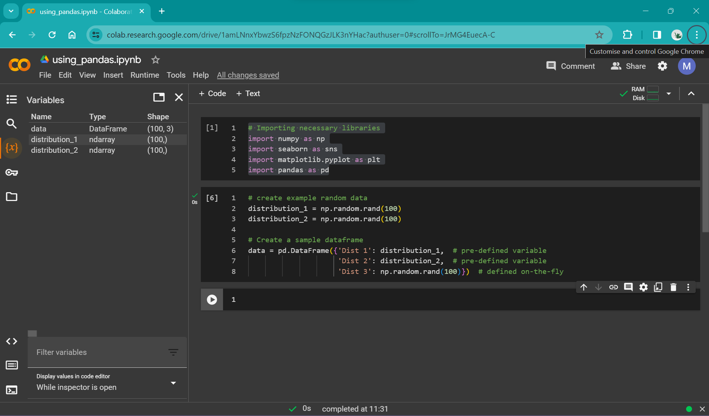
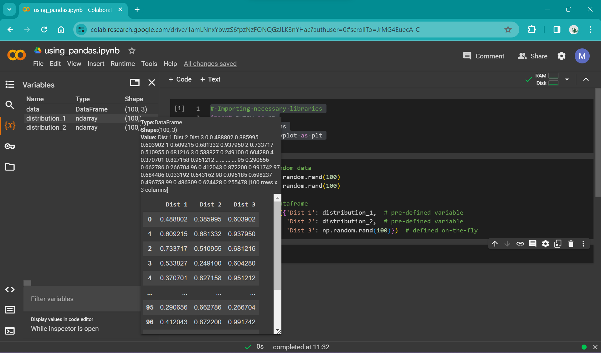
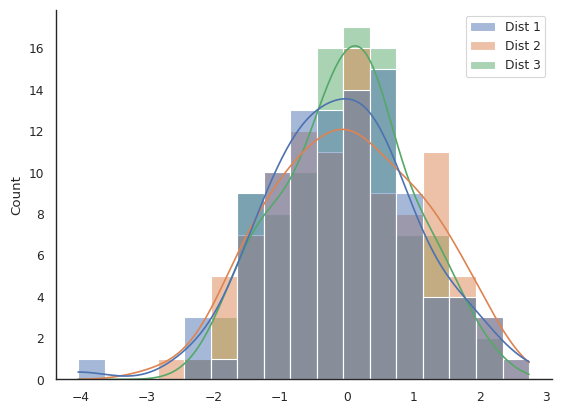
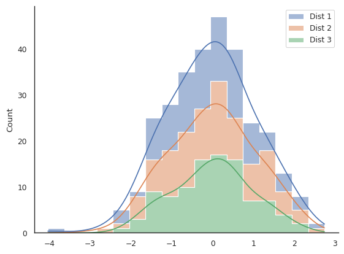
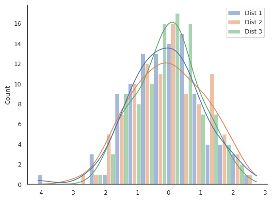
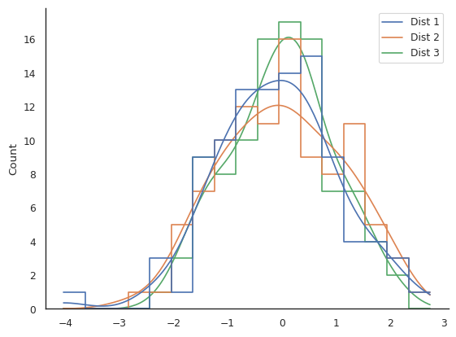
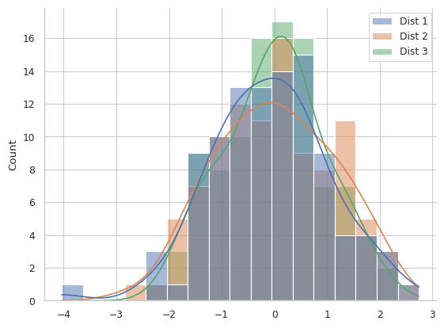

# Assessing distributions: histograms

In the last session, we used the seaborn library to apply some aesthetic changes to our plots, including sizing, colour palette, and adding a background grid. In this session, we are going to take this further and work with seaborn directly to build the plot.

While we build our plots, we will also be thinking about the idea of "chartjunk" and how plots can be made too busy and difficult to understand by either adding unnecessary aesthetic flourishes like patterns and colours, or by trying to cram too much data into a single plot. Different people have different tolerance limits for "chartjunk"&mdash;keep an eye out to see where your limit lies as we progressively add more and more junk to our plots.

```{admonition} Using seaborn
:class: dropdown

Seaborn is a library for data visualisation built on top of matplotlib.

From the [seaborn homepage](https://seaborn.pydata.org/):
> It provides a high-level interface for drawing attractive and informative statistical graphics.

Seaborn provides you with a selection of templates for frequently used statistical plots. This allows you to quickly produce common plot types in very few lines of code, without building them from scratch in matplotlib.

However, you can also tweak things using matplotlib functions, but sometimes there may be conflicts in the background which could lead to unexpected behaviour.

In general:
- If you need a plot that matches the structure of one in the [seaborn gallery](https://seaborn.pydata.org/examples/index.html), this library will allow you to rapidly build this.
- If you want complete aesthetic control over your plots, including irregularly gridded panels, overlaid plots etc., then either seaborn + matplotlib, or pure matplotlib will let you achieve this.
```

For this session, we will be using a histogram to display a distribution. Again, we are going to be generating random data.

In the previous session, we generated data stored using numpy and stored them in `np.array` objects, assigned to variables, like this:

```python
# create example random data
time = np.arange(10)
signal_1 = np.random.rand(10)
signal_2 = np.random.rand(10)
signal_3 = np.random.rand(10)
```

In this session, we are going to do similar, except instead of storing each array of random numbers as a different variable, we are going to put them all together in a *dataframe* using the library *pandas*. Additionally, instead of using the `np.random.rand()` function, we are going to use the `np.random.randn()` function - spot the difference! Read the docs [here](https://numpy.org/doc/stable/reference/random/generated/numpy.random.randn.html).

```{admonition} Pandas dataframe
:class: tip

According to the pandas documentation, a dataframe is a:
> Two-dimensional, size-mutable, potentially heterogeneous tabular data.

- A dataframe is a table that can contain different *types* of data
- It is very similar to a spreadsheet with different columns and rows
- Individual cells of this "spreadsheet" can contain lists, arrays, strings etc.
- Arithmetic operations can be applied to rows or columns
```

## Using pandas in colab

Lets start by importing all the libraries that we are going to use:

```python
# Importing necessary libraries
import numpy as np
import seaborn as sns
import matplotlib.pyplot as plt
import pandas as pd
```

Pandas library generally takes the alias `pd`.

If we want to compare two different random distributions, we could assign them to variables as we did in the previous session:


```python
# create example random data
distribution_1 = np.random.randn(100)
distribution_2 = np.random.randn(100)
```

This code will create two arrays of pseudo-random normally distributed numbers, assigned to the variables `distribution_1` and `distribution_2`. However, we can instead stick these in a `dataframe` using pandas. Replacing the above lines of code, we get:

```python
# create example random data
distribution_1 = np.random.randn(100)
distribution_2 = np.random.randn(100)

# Create a sample dataframe
data = pd.DataFrame({'Dist 1': distribution_1,  # pre-defined variable
                     'Dist 2': distribution_2,  # pre-defined variable
                     'Dist 3': np.random.randn(100)})  # defined on-the-fly
```

As you can see from this snippet, you can either pre-define variables (`distribution_1` and `distribution_2`) and then insert them into the code, or define them in-place inside the dataframe.

```{admonition} What's going on with the curly brackets inside the dataframe?
:class: dropdown
A dataframe takes data in the form of a `dictionary`, which is surrounded by curly brackets `{}`, and contains string `keys` or labels for the data, followed by a colon and then the data. 

A dictionary generally looks like this:

`example_dict = {"Key 1" : [0, 1, 2, 3, 5], "Key 2" : np.array([10, 20, 30, 40])}`

As you can see from the above example, `dicts` can take different *types* of data, including lists and numpy arrays.

In the case of using this with pandas, the `dict` object essentially defines the column headers (the `keys`), and the column values (the list or array of numbers).
```

We now have a table called `data` that contains `'Dist 1'`, `'Dist 2'` and `'Dist 3'`. As you practise using pandas (and Python in general), you will get much more familiar with these data types, and much more comfortable with using them. However, when you first start, it can feel like a big leap moving from using a visible spreadsheet such as an Excel workbook, where you can see your data arranged in a table, to using something like pandas where it is "hidden". However, when working with manageably-sized data frames, we can visualise them using a number of tools that are available working with Google Colab (and other Jupyter-notebook tools).

One of the simplest ways is just by using the variable viewer in the left panel in colab:

| | 
|:--| 
| Caption *Alt text: here* |

| | 
|:--| 
| Caption *Alt text: here* |

This allows a quick preview of the dataframe and is useful for basic checks (e.g. that the values look sensible).

For more extensibility, you can use Colab's [data table display tool](https://colab.research.google.com/notebooks/data_table.ipynb) to render data tables.
In order to use this for our newly created dataframe, add these lines to your import statements and re-run that cell:

```python
# data table view
from google.colab import data_table
data_table.enable_dataframe_formatter()
```

Then, in a cell below where you define the dataframe `data`, call the dataframe by simply running:

```python
data
```

You can also turn off this functionality (if it starts to get in your way!) by running:

```python
data_table.disable_dataframe_formatter()
```

## Plotting with seaborn and pandas

Now that we've created our example data, we can start plotting it. Seaborn is built to work well with pandas dataframes; they integrate very tidily. We're going to start by just focusing on `"Dist 1"`, the first random array stored in our dataframe `data`.
We can create a bare-bones plot by setting up the `fig` and `ax` as we have done previously, then calling the seaborn `histplot` function. Unlike when we were using matplotlib, we don't prefix `histplot` with `ax` (like `ax.plot`); instead, we pass `histplot` the argument `ax=`. We've called our axes "ax", so we get the slightly silly looking argument `ax=ax`. We will see later in the course how this becomes more relevant when you have a multi-part figure!

```
# Create a figure and axes
fig, ax = plt.subplots()

# plot the histogram
sns.histplot(data, x="Dist 1", ax=ax)
```

We can apply all the aesthetic options provided by seaborn to make this more visually appealing:

```python
# default seaborn theme
sns.set_theme()

# change the style of the plot
sns.set_style("white")

# set the "context" of the plot
sns.set_context("paper")

# Create a figure and axes
fig, ax = plt.subplots()

# Create a overlaid histogram with a kde line
sns.histplot(data, x="Dist 1", kde=True, ax=ax)

# get rid of top and right spines
sns.despine()

# Show plot
plt.show()
```

In the above example, we have added an argument to the histplot function: `kde=True`. Have a look at the [`histplot` documentation](https://seaborn.pydata.org/generated/seaborn.histplot.html) to see what this does:

> Compute a kernel density estimate to smooth the distribution and show on the plot as (one or more) line(s).

Seaborn makes applying and visualising statistical methods such as [KDE](https://en.wikipedia.org/wiki/Kernel_density_estimation) rapid and straightforward. Of course, a potential drawback is that because statistical methods can be applied so easily with default choices hidden behind the scenes, it can be easy to choose options without understanding the underlying mathematics or whether it is a sensible choice for your data. Make sure to read through the `api` or docs before you choose a plot that you want to build, to make sure it is a sensible choice for your research. Discuss this with your colleagues/cohort/collaborators/supervisors if you're not sure.

### Plotting multiple distributions

But our dataframe `data` contains multiple distributions. What if we want to plot all three? The `histplot` function has a default argument ready to go in case you add multiple data series to plot: `multiple = layer`. We can plot the entire dataframe by simply removing the argument `x='Dist 1'` from the `histplot` function call:

```python
# default seaborn theme
sns.set_theme()

# change the style of the plot
sns.set_style("white")

# set the "context" of the plot
sns.set_context("paper")

# Create a figure and axes
fig, ax = plt.subplots()

# Create a overlaid histogram with a line
sns.histplot(data, kde=True, ax=ax)

# get rid of top and right spines
sns.despine()

# Show plot
plt.show()
```

You should have a figure that looks something like this:

| | 
|:--| 
| Caption *Alt text: here* |

We can all agree that this is probably not the best way of viewing this data.

We are going to have a look at two different arguments that `histplot` can take that will help us control the appearance of our plot: `multiple` and `element`.

|Argument | `multiple` | `element` |
|--:|:--|:--|
| Default value| `layer` | `bars` |
| Options | `“layer”, “dodge”, “stack”, “fill”`| `“bars”, “step”, “poly”`|

In order to understand what these arguments do, try to recreate the following plots (the answer is in the drop-down menu, but try to figure it out yourself through trial and error!). Remember your data will be different so they won't look identical.

| | 
|:--| 
| Challenge plot #1. What are some potential issues with this plot? *Alt text: here* |

| | 
|:--| 
| Challenge plot #2. Is this plot easy to interpret? *Alt text: here* |


| | 
|:--| 
| Challenge plot #2. A truly awful plot, to show you that just because you can choose and option in seaborn, doesn't mean it's sensible. This one has an extra challenge... hint: you'll need to change the `fill` argument. *Alt text: here* |


```{admonition} Challenge solutions
:class: dropdown

Challenge plot one:
`sns.histplot(data, kde=True, multiple="stack", element="step", ax=ax)`

Challenge plot two:
`sns.histplot(data, kde=True, multiple="dodge", element="bars", ax=ax)`

Challenge plot three:
`sns.histplot(data, kde=True, multiple="layer", element="step", fill=False, ax=ax)`

```

## What can we do when our plot becomes too busy?

Lets look at the example plot below, where we have added a grid to the background:

| | 
|:--| 
| Is this plot easy to interpret? *Alt text: here* |

You can recreate a similar plot with your example data using this code snippet:

```python
# default seaborn theme
sns.set_theme()

# change the style of the plot
sns.set_style("whitegrid")

# set the "context" of the plot
sns.set_context("paper")

# Create a overlaid histogram with kde curves
sns.histplot(data, kde=True,)

# get rid of top and right spines
sns.despine()

# Show plot
plt.show()
```

It is difficult to interpret this plot beyond just stating that all datasets have a roughly normal distribution around zero. The KDE lines are a bit easier to compare than the overlaid semi-transparent bar-style histograms, but there is still an awful lot of clutter.

### Reduce the groups of data being shown concurrently

One option is to simply cut back on the data you are showing. This could mean only including `"Dist 1"` or `"Dist 2"` or `"Dist 3"`, or making a separate plot for each.

Or, you could cut out the KDE plot and show the histograms overlaid but with the fill removed, either like this:

```
sns.histplot(data, element="step", fill=False)
```

or this

```
sns.histplot(data, element="poly", fill=False)
```

We could also instead only show the KDE plot and cut out the histogram beneath iy by swapping the `histplot` function for the `kdeplot` function:

```
sns.kdeplot(data)
```

But each of these plots have their own issues; for example read [here](https://seaborn.pydata.org/tutorial/distributions.html#kernel-density-estimation-pitfalls) on the limitations of KDE plots.

### "Zoom out" and show more coarse-grained data

Another approach is to reduce the resolution of the plot. Up until now, we have let the `histplot` function automatically set the bin width for the histogram. This can be [manually controlled](https://seaborn.pydata.org/tutorial/distributions.html#choosing-the-bin-size), either by using the argument `bins` and defining the number of bins to use over the range of data, or by defining `binwidth` directly:

```python
sns.histplot(data, kde=True, binwidth=1, multiple="dodge", shrink=0.8)
```

This code additionally shrinks the width of the bars so that space is present between different clusters of bars that represent the same region of data.

### Multi-panelled plots

Another option where you want to compare data is to create a single plot with multiple panels or axes.

Complete the following code snippet to make a multi-panel plot:


```python
# default seaborn theme
sns.set_theme()

# change the style of the plot
sns.set_style("white")

# set the "context" of the plot
sns.set_context("paper")

# Create a figure and axes
fig, axs = plt.subplots(3)

# Create a histogram with a kde line for each distribution in a separate panel
sns.histplot(data, x="Dist 1", kde=True, ax=axs[0]) # Remember, indexing in Python starts at zero
# ADD CODE HERE

# get rid of top and right spines
sns.despine()
```

```{admonition} Answer
:class: dropdown
Beneath the line:

`sns.histplot(data, x="Dist 1", kde=True, ax=axs[0])`.

add these two lines:

`sns.histplot(data, x="Dist 2", kde=True, ax=axs[1])`

`sns.histplot(data, x="Dist 3", kde=True, ax=axs[2])`
```

You might notice that the x-axis labels are overlapped and it looks a little messy. We can add the command `plt.tight_layout()` which adjusts the padding between plots automatically. Note that you can do this manually if you need more fine-grained control, but usually this function does a good enough job!

# Additional challenges

```{admonition} Make a plot with a single panel/axes that only shows "Dist 1" and "Dist 2"
:class: dropdown
Answers here!
```