# Understanding composition: bar charts

Bar charts are valuable tools for displaying and comparing categorical data. They visually represent the distribution or composition of data across various categories, enabling easy identification of patterns, trends, and relationships. Bar charts are effective in conveying information in a clear and concise manner, making them a popular choice for communicating data insights to a wide audience.

While making a series of example bar charts, we will discuss visual encoding in this context

## Example data

For this bar plot, we will be using the following simple dataframe, with numerical values across different categories:

| Category | Results A | Results B |
|:--|:--|:--|
| Cat 1 | 1 | 2 |
| Cat 2 | 27 | 35 |
| Cat 3 | 32 | 15 |
| Cat 4 | 15 | 18 |

We will plot these in a variety of different ways, highlighting why different ways of plotting are useful in different situations, and conversely, how they could mislead you or your audience. Later, we will also look at some other categorical plot types that are possible.

You can either build this dataset, or download it from GitHub.

### Create data set

First, import the required packages:

```python
# Import necessary libraries
import numpy as np
import seaborn as sns
import matplotlib.pyplot as plt
import pandas as pd
```

Then, create the data frame:

```python
categories = ["Cat 1", "Cat 2", "Cat 3", "Cat 4"]
results_a = [1, 27, 32, 15]
results_b = [2, 35, 15, 18]

data = pd.DataFrame({"Results A": results_a,
                     "Results B": results_b},
                    index=categories)
```

### Download the data

Alternatively, you can download the data instead of building the dataframe.

You can run this command from Colab:

```bash
!wget https://raw.githubusercontent.com/ARCTraining/data-vis/main/data_downloads/05_barplots.csv
```

Alternatively, you can visit the [GitHub repository](https://github.com/ARCTraining/data-vis/blob/main/data_downloads/05_barplots.csv) and click on the download button, save to your machine, then upload to Colab.

Then you can load in the data:

```python
data = pd.read_csv("/content/05_barplots.csv", index_col=0)
```

## Basic bar plot using Pandas

For our initial example, we want to create a bar plot with two different groupings: this will show the categories "Cat 1" to "Cat 4" on the x-axis, with colours differentiating "Results A" and "Results B".

We will later use seaborn to build a bar plot, but for now we are going to use a built-in function from pandas as this allows us to create a stacked bar plot.

```python
# Create figure and axes
fig, ax = plt.subplots()

# pandas.plot with option "bar" to create barplot
data.plot(kind="bar", ax=ax, stacked=True) # can toggle "stacked"

# Set labels
ax.set_xlabel("Category")
ax.set_ylabel("Count")
```

|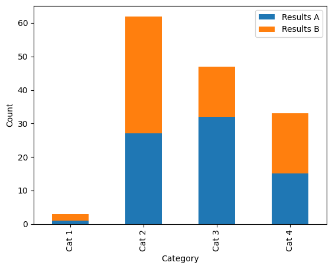 | 
|:--| 
| Our basic example stacked bar plot. *Alt text: a stacked bar plot with three categorical groupings on the x axis: "Cat 1", "Cat 2", "Cat 3" and "Cat 4", and two groupings shown by colour (blue and orange): "Results A" and "Results B". The y axis shows count, scaled from 0&ndash;65.* |
|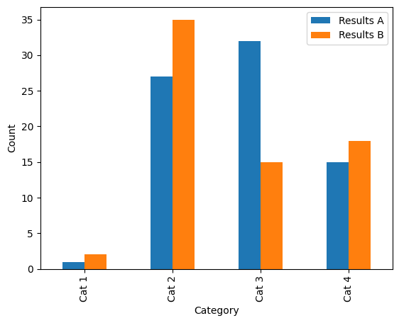 | 
| The same data as above, but with bars staggered instead of stacked. *Alt text: a bar plot with three categorical groupings on the x axis: "Cat 1", "Cat 2", "Cat 3" and "Cat 4", and two groupings shown by colour (blue and orange): "Results A" and "Results B". The y axis shows count, scaled from 0&ndash;65.* |

## Visual encoding

As we discussed in previous sessions, it is a good idea to have a few different methods of distinguishing categories of data, and not to rely solely on colour. In the case of a bar plot, we are a little limited in that we do not have a choice of line style or marker shape to quickly differentiate different data series.

Before we do anything else, let's just pick a better colour scheme from [Color Brewer](https://colorbrewer2.org/#type=diverging&scheme=PuOr&n=5). We can check how well this colour palette will work using [Viz Palette](https://projects.susielu.com/viz-palette?colors=[%22#e66101%22,%22#b2abd2%22]&backgroundColor=%22white%22&fontColor=%22black%22&mode=%22normal%22) to test it in greyscale and for a range of simulated colour sight difficulties.

Once we've picked a palette, we can define this in Python:

`new_palette = ["#e66101","#b2abd2"]`

This can then be used by simply adding the `color` variable to the function call (note that Python uses American spelling):

```python
data.plot(kind="bar", ax=ax, color=new_pal)
```
|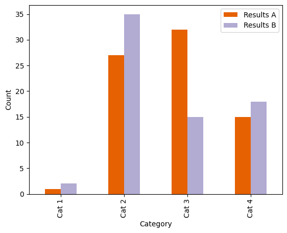 | 
|:--| 
| Our basic example bar plot, with a Color Brewer palette. These colours are better distinguishable in greyscale and with a colour vision deficiency. *Alt text: a stacked bar plot with three categorical groupings on the x axis: "Cat 1", "Cat 2", "Cat 3" and "Cat 4", and two groupings shown by colour (orange and lilac): "Results A" and "Results B". The y axis shows count, scaled from 0&ndash;65.* |


We can also add a pattern or "hatch" to the bars to further help distinguish them from each other. Unfortunately, it's a little bit more complex to add *different* hatch patterns to different categories. To add a basic hatch, just modify the `plot` function call:

```python
data.plot(kind="bar", ax=ax, color=new_pal, hatch="//")
```

To change the colour of the hatch, it's easiest to just modify the `edgecolor` argument:

```python
data.plot(kind="bar", ax=ax, color=new_pal, hatch=".", edgecolor="white")
```

Try out some of these hatches on your plot:

```python
hatches = [
    '/', '\\', '|', '-', '+', 'x', 'o', 'O', '.', '*',
    '//', '\\\\', '||', '--', '++', 'xx', 'oo', 'OO', '..', '**',
    '/o', '\\|', '|*', '-\\', '+o', 'x*', 'o-', 'O|', 'O.', '*-',
]
```

Note that the hatches apply to all bars: not very useful for distinguishing different categories. We can fix this by cycling through a list of different hatch patterns (with the same number of hatch patterns as there are categories). In order to make this a little easier, I've built a small **function** to do this for you. You just need to give it an ax (set up when you run `fig, ax = plt.subplots()`, and a list of hatches):

```python
def apply_hatch_pattern(ax, hatch_patterns):
    bars = ax.patches
    hatches = []
    for h in hatch_patterns:
        for i in range(int(len(bars)/len(hatch_patterns))):
            hatches.append(h)
    for bar, hatch in zip(bars, hatches):
        bar.set_hatch(hatch)
```

You can define this function by putting it in a cell and running it. Then you can use it by calling `apply_hatch_pattern(ax, hatch_patterns)` after you've created your plot. While the pandas plot function automatically builds a legend for you, you must add it again manually because it will not have the hatches overlaid.

```python
fig, ax = plt.subplots()

data.plot(kind="bar", ax=ax, color=new_pal, stacked=True, edgecolor="white")

apply_hatch_pattern(ax, hatch_patterns=["*", "//"])
ax.set_xlabel("Category")
ax.set_ylabel("Count")
ax.legend()
```

|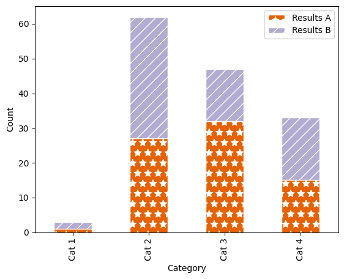 | 
|:--| 
| Our example stacked bar plot, with a Color Brewer palette and hatch markings. *Alt text: a stacked bar plot with three categorical groupings on the x axis: "Cat 1", "Cat 2", "Cat 3" and "Cat 4", and two groupings shown by colour (orange and lilac) and hatch pattern (diagonal lines,and stars): "Results A" and "Results B". The y axis shows count, scaled from 0&ndash;65.* |

## Comparing composition

When comparing the composition of a group, for example the proportion of "Results A" vs. "Results B" in each of the categories, it can be difficult when the absolute number of results varies largely, for example between "Cat 1" and "Cat 2". We can visualise the data in a different way to better pick out the proportions per category by normalising the values in each category to 100:

```python
data["Total"] = data["Results A"] + data["Results B"]
data["Results A (%)"] = (data["Results A"]/data["Total"]) * 100
data["Results B (%)"] = (data["Results B"]/data["Total"]) * 100
```

This code adds the columns `"Total"`, `"Results A (%)"` and `"Results A (%)"` to our dataframe:

| Category | Results A | Results B | Total | Results A (%) | Results B (%) |
|:--|:--|:--|:--|:--|:--|
| Cat 1 | 1 | 2 | 3 | 33.333333 | 66.666667 |
| Cat 2 | 27 | 35 | 62 | 43.548387 | 56.451613 |
| Cat 3 | 32 | 15 | 47 | 68.085106 | 31.914894 |
| Cat 4 | 15 | 18 | 33 | 45.454545 | 54.545455 |

We can now plot these new columns. Because we *only* want to plot `"Results A (%)"` and `"Results A (%)"` and not the entire dataframe, we now need to specify just these columns. In the same way that we can pull out one column of a dataframe by using square brackets (like `data["Total"]`), we can also include a **list** of column names like `["Results A (%)", "Results B (%)"]`:

```python
fig, ax = plt.subplots()
data[["Results A (%)", "Results B (%)"]].plot(kind="bar",
                                              stacked=True,
                                              ax=ax,
                                              color=new_pal,
                                              edgecolor="white")

apply_hatch_pattern(ax, hatch_patterns=["*", "//"])

ax.set_xlabel("Category")
ax.set_ylabel("Proportion [%]")
```

|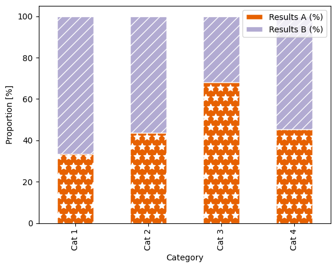 | 
|:--| 
| Our example stacked bar plot, now shown as a proportion of 100 %. *Alt text: a stacked bar plot with three categorical groupings on the x axis: "Cat 1", "Cat 2", "Cat 3" and "Cat 4", and two groupings shown by colour (orange and lilac) and hatch pattern (diagonal lines,and stars): "Results A" and "Results B". The y axis shows proportion, scaled from 0&ndash;100 %.* |

Because the bar plots now fill the entire axes area, the legend awkwardly overlaps, so we need to move it outside of the plot. Also, because we didn't manually call `ax.legend()`, the legend has not updated to include the hatch patterns.

We can move the legend by adding arguments into the `ax.legend()` function call:

`ax.legend(bbox_to_anchor=(0.5, 1.15), loc='upper center', ncol=2, frameon=False)`,

where `bbox_to_anchor` tells you where on the "bounding box" (the axes area) you want the legend positioned (so in this case, 0.5 along x - so centered horizontally, then 1.15 on y - so just above the plotting area); `loc` tells you where on the legend is being positioned here (so the upper centre of the legend box); `ncol` defines that there should be two columns as opposed to the default of one column and multiple rows; and finally `frameon = False` switched off the grey box around the legend.

We can also add seaborn's despine function to tidy up the plot:

```python
fig, ax = plt.subplots()
data[["Results A (%)", "Results B (%)"]].plot(kind="bar",
                                              stacked=True,
                                              ax=ax,
                                              color=new_pal,
                                              edgecolor="white")

apply_hatch_pattern(ax, hatch_patterns=["*", "//"])

ax.set_xlabel("Category")
ax.set_ylabel("Proportion [%]")
ax.legend(bbox_to_anchor=(0.5, 1.15), loc='upper center', ncol=2, frameon=False)
sns.despine()
```

|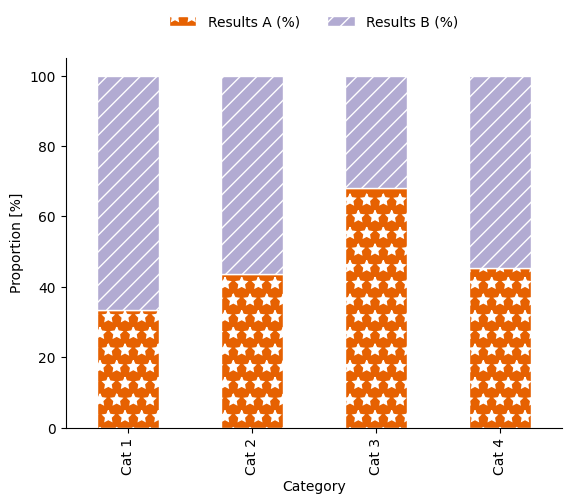 | 
|:--| 
| Our example stacked bar plot, now shown as a proportion of 100 %. *Alt text: a stacked bar plot with three categorical groupings on the x axis: "Cat 1", "Cat 2", "Cat 3" and "Cat 4", and two groupings shown by colour (orange and lilac) and hatch pattern (diagonal lines,and stars): "Results A" and "Results B". The y axis shows proportion, scaled from 0&ndash;100 %.* |

## Possible pitfalls

For this section, let's make a quick multipanelled plot following what we did [in this session](https://arctraining.github.io/data-vis/04-distribution-histogram.html#multi-panelled-plots) and compare the two different ways of plotting a bar chart.

|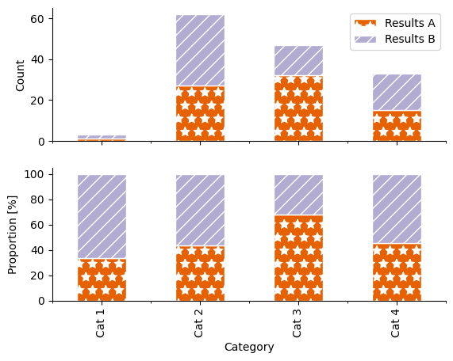 | 
|:--| 
| Challenge barplot. Try to recreate this plot. *Alt text: a two panelled stacked bar plot with three categorical groupings on the x axis: "Cat 1", "Cat 2", "Cat 3" and "Cat 4", and two groupings shown by colour (orange and lilac) and hatch pattern (diagonal lines,and stars): "Results A" and "Results B". The y axis on the lower panel shows absolute count, scaled from 0&ndash;60. The y axis on the lower panel shows proportion, scaled from 0&ndash;100 %.* |


```{admonition} Recreate the two-panelled plot above
:class: dropdown

```{glue}python
fig, axs = plt.subplots(2, sharex=True)
data[["Results A", "Results B"]].plot(kind="bar",
                                     stacked=True,
                                     ax=axs[0],
                                     color=new_pal,
                                     edgecolor="white")

apply_hatch_pattern(axs[0], hatch_patterns=["*", "//"])

data[["Results A (%)", "Results B (%)"]].plot(kind="bar",
                                              stacked=True,
                                              ax=axs[1],
                                              color=new_pal,
                                              edgecolor="white",
                                              legend=False)

apply_hatch_pattern(axs[1], hatch_patterns=["*", "//"])

axs[1].set_xlabel("Category")

axs[0].set_ylabel("Count")
axs[1].set_ylabel("Proportion [%]")

axs[0].legend()
sns.despine()
```

```{admonition} Challenge
What are some of the potential issues in these two different ways of presenting data?
```

### Changing y-limits

Sometimes when values of different categories are quite similar, it can be tempting to change the limits of the y-axis in order to highlight the differences between them.

Use this code to create a two-panelled plot with the same data in each panel:

```python
fig, axs = plt.subplots(2, sharex=True)
data[["Results A (%)", "Results B (%)"]].plot(kind="bar",
                                     ax=axs[0],
                                     color=new_pal,
                                     edgecolor="white",
                                     legend=False)

apply_hatch_pattern(axs[0], hatch_patterns=["..", "///"])

data[["Results A (%)", "Results B (%)"]].plot(kind="bar",
                                              ax=axs[1],
                                              color=new_pal,
                                              edgecolor="white",
                                              legend=False)

apply_hatch_pattern(axs[1], hatch_patterns=["..", "///"])

axs[1].set_xlabel("Category")

axs[0].set_ylabel("Proportion [%]")
axs[1].set_ylabel("Proportion [%]")
axs[0].set_ylim(0, 70)
axs[1].set_ylim(25, 70)

axs[0].legend(bbox_to_anchor=(0.5, 1.15), loc='upper center', ncol=2, frameon=False)

sns.despine()
```

How could the resulting graphic mislead readers about the results?

|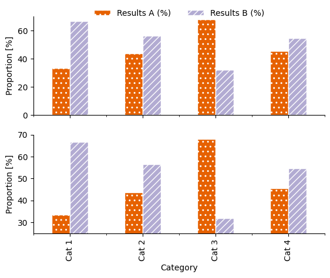 | 
|:--| 
| Spot the difference! The same data is used in each. *Alt text: a two panelled stacked bar plot with three categorical groupings on the x axis: "Cat 1", "Cat 2", "Cat 3" and "Cat 4", and two groupings shown by colour (orange and lilac) and hatch pattern (diagonal lines,and stars): "Results A" and "Results B". The y axis on the upper panel shows proportion, scaled from 0&ndash;70 %. The y axis on the lower panel shows proportion, scaled from 25&ndash;70 %.* |

### Use of colour

We've discussed choosing colour with reference to accessibility and to enable greyscale printing. What about the meanings we associate with colour?

- Colours can have a symbolic meaning, attached to ideas, brands, countries, political parties, etc.
    - These meanings may be different to different people, in different places
    - These meanings may be rooted in real-world colour associations (green linked to grass, blue to sky) or may be the result of marketing campaigns
- Colours can be perceived as "ordered" or "unordered"
- Saturation, tone and hue all contribute to how we experience colour


Lets look at these example plots that have been given a title that suggests a context for the categories being shown, but do not contain category names. For simplicity of comparison, no patterns have been used. What assumptions might a reader make about the plot? What are issues that could arise due to these assumptions or associations with regards to colour?

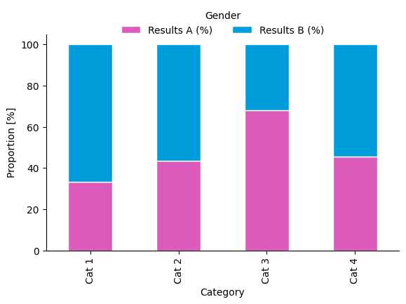

```{admonition} Gender assumptions
:class: dropdown
Colour has strong stereotypical associations with gender and sex.

Using the colour palette in the plot above reinforces stereotyping. From the American Chemical Society's Inclusivity Style Guide:
>Another consideration is avoiding colors that perpetuate stereotypes. For example, the Urban Institute’s [Do No Harm Guide: Applying Equity Awareness in Data Visualization](https://www.urban.org/research/publication/do-no-harm-guide-applying-equity-awareness-data-visualization) recommends against using pink for women and blue for men—a combination that could reinforce thinking of gender as a binary construct—as well as matching colors to skin tones (like using black to represent Black people).
```

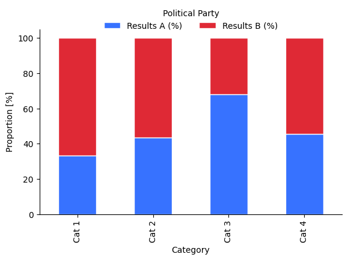

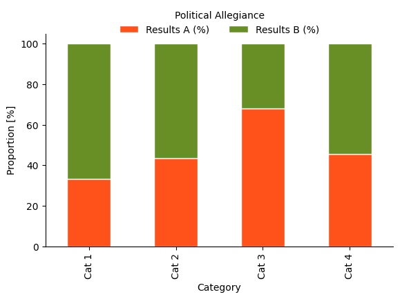

```{admonition} Political associations
:class: dropdown
Colour has strong associations with different political parties, which can vary with geographical location.

What are issues that might arise from using these colours?
```

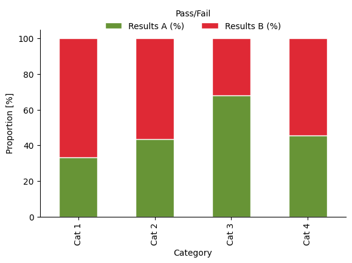

```{admonition} Symbolic meaning
:class: dropdown
Colour can be symbolically linked with concepts such as on/off, good/bad, pass/fail. Besides the obvious issues with using red/green as the only method of differentiation between categories, what are some complications that could arise through this?
```

We cannot avoid the fact that certain colour combinations evoke certain beliefs or assumptions in readers. 

The [ACS style guide to using colour in data visualisation](https://www.acs.org/about/diversity/inclusivity-style-guide/data-visualization.html#choosing-color-in-data-visualizations) states:
>Avoid choosing colors at random without considering their meaning or cultural associations, especially when the color's job is simply to provide distinction against adjacent content. Recognize when certain colors may perpetuate stereotypes. For example, when representing gender data, consider using a color palette that does not rely on binary associations, as pink and blue do.

In general, you need to be aware that associations with different colours exist.
- For your research area, are there any specific symbolic links you should avoid?
- Understand that colours can evoke certain assumptions in readers. Understand these, address whether they are acceptable assumptions, and design your plot appropriately.
- If you do not want to carry the baggage of connotations with certain colours into your plot, use completely unrelated colour schemes (e.g. do not invert the colour choices of one the above plots)

### Ordered colours

Sequential colour schemes (see [Color Brewer](https://colorbrewer2.org/) for examples) are perceived as ordered, and so can infer order onto data when used for plotting.

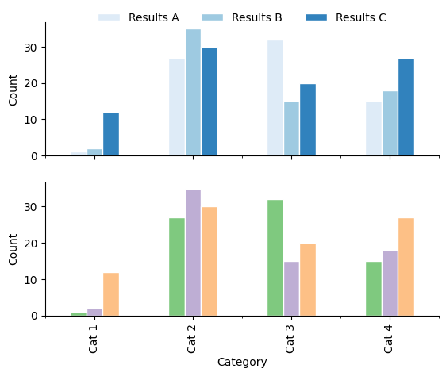

```{admonition} Implying order
:class: tip
The visual encoding of a data set should not infer order when there is none. A qualitative colour palette should be used if this is the case.

In addition to unintentionally implying order with colour, also consider the arangement and ordering of data from left to right and top to bottom. [Order your data strategically](https://www.acs.org/about/diversity/inclusivity-style-guide/data-visualization.html#ordering-groups-in-data-visualizations), and carefully consider how this ordering will influence your audience.
```

### Stacked bar charts

Stacked bar charts are a popular way of representing compositional data and exploring the proportions of different components in a category or group. A difficulty appears (especially with more than one data set stacked on top of each other) when trying to compare the size of the data series not aligned on the x-axis: because neither "end" of the bar segments are aligned, it is difficult to compare or even estimate length.

- Are your data really served by stacking the bars or by finding a different way to represent this data?
- If your data are not absolute values and instead are the result of statistical calculations (e.g. they are the mean value for a certain category), look at plots such as [boxplots](https://seaborn.pydata.org/examples/grouped_boxplot.html) or [violin plots](https://seaborn.pydata.org/examples/grouped_violinplots.html).

```{admonition} Key Points
:class: tip
- Absolute and proportional bar charts can highlight and disguise different relationships between data
- Bar charts are useful when the value zero is important in comparing groups - use a different visualisation type if you feel the need to move the y-limit above zero to highlight your results
- Do not imply order in unordered variables through the use of colour or non-strategic spatial ordering on the page (use alphabetical or numerical ordering to avoid biases)

Further reading: The American Chemical Society [Data visualisation inclusivity style guide](https://www.acs.org/about/diversity/inclusivity-style-guide/data-visualization.html)
```


