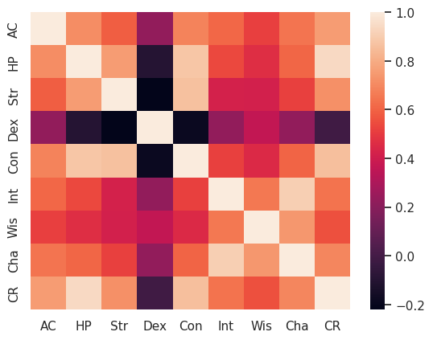
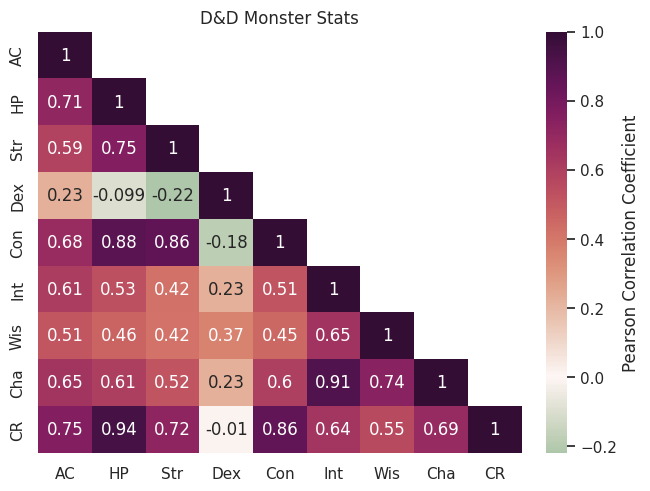
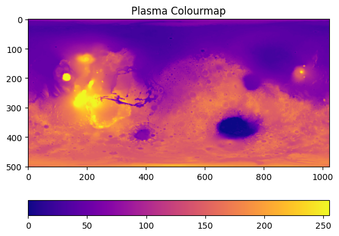
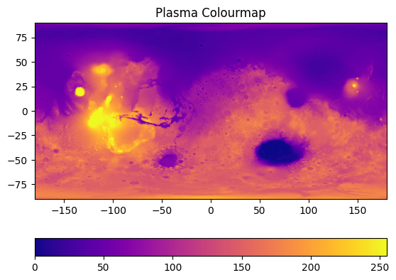

# Spatial distributions and correlation: heatmaps

This exercise is inspired by the blog post [Dungeons & Data](https://peritract.github.io/2020/05/14/dungeons-and-data/) written by Dan Keefe in 2020. As an extra exercise when you've finished this course, have a look through the attached [Jupyter notebooks](https://github.com/Peritract/data-projects/tree/master/dungeons-and-data) to practise building a whole suite of different plots. The data used has been pulled from the [Dungeons and Dragons 5th edition API](https://www.dnd5eapi.co/), with a little bit of data-wrangling to get it into a nice format for the sake of this tutorial.

This dataset contains stats for a range of D & D monsters. Each monster has the following parameters associated with them:

| Parameter | Description |
|:--|:--|
| AC | Armour class |
| HP | Hit Points |
| Str | Strength |
| Dex | Dexterity |
| Con | Constitution |
| Int | Intelligence |
| Wis | Wisdom |
| Cha | Charisma |
| CR | Challenge Rating |

Essentially, we want to figure out if there is a strong correlation, either positive or negative, between any of these stats.


As a little extra challenge at the end of this section, we also show how to load in an image and plot it using a colour map; this is useful for `.tiff` images from microscopy, maps, DEMs... any very easy to do!


## Download the data

This is the only tutorial that doesn't include randomly generated data, to make sure that at least once you have to load in data manually.

You can run this command from Colab:

```bash
!wget https://raw.githubusercontent.com/ARCTraining/data-vis/main/data_downloads/monsters_stats.csv
```

Alternatively, you can visit the [GitHub repository](https://github.com/ARCTraining/data-vis/blob/main/data_downloads/monsters_stats.csv) and click on the download button, save to your machine, then upload to Colab.


## Heatmaps

We have already discussed colour maps at length, and have shown how they can be used in a whole array of different situations: to add a third dimension to scatter plots, to represent an image as data, and to highlight statistical tables in order to make them more readable.

First, we are going to use them to build a [**correlation matrix**](https://www.w3schools.com/datascience/ds_stat_correlation_matrix.asp). This is essentially a table with parameters of a dataset along the rows and columns, showing the correlation coefficients between every pair of parameters. We can use a heatmap to make this table more readable at a glance.

### Cmocean colour maps

For this example, we're going to also install an extra Python package that will give you access to more colour maps: [cmocean](https://matplotlib.org/cmocean/).

If you try *importing* cmocean, you will get an error message something like this:

```python
---------------------------------------------------------------------------
ModuleNotFoundError                       Traceback (most recent call last)
<ipython-input-21-99fef696d6c8> in <cell line: 1>()
----> 1 import cmocean

ModuleNotFoundError: No module named 'cmocean'

---------------------------------------------------------------------------
NOTE: If your import is failing due to a missing package, you can
manually install dependencies using either !pip or !apt.

To view examples of installing some common dependencies, click the
"Open Examples" button below.
---------------------------------------------------------------------------
```

As explained in the error message, this module is not one available by default in Colab, so you need to install it. This is very simple. All we need to do is use `!` to access the underlying terminal on our cloud machine:

```bash
!pip install cmocean
```

You will get output something like this if it is successful:

```bash
Collecting cmocean
  Downloading cmocean-3.1.3-py3-none-any.whl (222 kB)
     ━━━━━━━━━━━━━━━━━━━━━━━━━━━━━━━━━━━━━━━━ 222.1/222.1 kB 5.5 MB/s eta 0:00:00

>> Lots of dependencies...

Installing collected packages: cmocean
Successfully installed cmocean-3.1.3
```

You can now import cmocean alongside the other packages we need for this section:

```python
import pandas as pd
import numpy as np
import seaborn as sns
import matplotlib.pyplot as plt
import cmocean
```

Now in addition to all the [Matplotlib colour maps](https://matplotlib.org/stable/users/explain/colors/colormaps.html) and [Seaborn colour maps](https://matplotlib.org/stable/users/explain/colors/colormaps.html), you now have access to [Cmocean colour maps](https://matplotlib.org/cmocean/).

When plotting, you usually define the colourmap inside the plotting function with the `cmap` argument. For the main names Matplotlib colour maps, you can just use their name, so `cmap="plasma"`. For Seaborn colour maps, it's slightly more text: `cmap=sns.color_palette("rocket", as_cmap=True)`; you give the name of the *palette* ("rocket") and then say you want it *as a colour map*. For cmocean, you just need to prefix the colour map name with `"cmo."`: `cmap="cmo.curl"`. This may be a little confusing now, but we will have lots of practise in thie section!

## Load in the data

Now you're ready to load in the data

```python
monsters = pd.read_csv("/content/monsters_stats.csv", index_col=0)
```

Use the file explorer and some of the DataFrame exploration tools to see what this looks like: you can double click the csv file itself in the file explorer on the left had side, or after loading the data you can simply call `monsters` in an empty cell to get a preview.


## Calculating correlation

In order to make a correlation matrix, we need to calculate the correlation between each parameter! Thankfully, this is very easy using the pandas function `corr`:

```python
corr = monsters.corr(numeric_only=True)
```

If you have a look at `corr`, you'll see we essentially already have a correlation matrix in its basic table form. Have a look at the [`corr` documentation](https://pandas.pydata.org/docs/reference/api/pandas.DataFrame.corr.html).

## Basic heatmap in seaborn

Now we can plot a basic heatmap using this correlation matrix. Lets start with the default settings, and build up from there.

```python
fig, ax = plt.subplots()
sns.heatmap(corr, ax=ax)
```

You should have a figure that looks something like this:



Nice, but we have a bit of work before it's finished. Remember that any arguments inside a function that have a default value (so use a `=`) can be given in any order.

### Annotations

It's currently a little bit hard to read off values accurately, so lets add back in the elements of the table version that were useful: having the actual values printed out. These can be added as annotations:

```python
sns.heatmap(corr, annot=True, ax=ax)
```

Note that seaborn will automatically adjust the font colour to suit the background colour.

### Centering the heatmap

Before we start picking out a sensible heatmap, lets centre it on zero:

```python
sns.heatmap(corr, annot=True, center=0, ax=ax)
```

### Picking a heatmap

Find a nice (and scientifically valid) colour map:

- [Matplotlib colour maps](https://matplotlib.org/stable/users/explain/colors/colormaps.html)
- [Seaborn colour maps](https://matplotlib.org/stable/users/explain/colors/colormaps.html)
- [Cmocean colour maps](https://matplotlib.org/cmocean/)

I'm going to use the cmocean map "curl":

```python
sns.heatmap(corr, annot=True, cmap="cmo.curl", center=0, ax=ax)
```

### Masking the top half

The correlation matrix is looking pretty great already, but it could be even more readable if we simplified it. There is symmetry around the diagonal, so we can just remove the top half to make it less busy and easier to read.

We can do this by creating a `mask` and then passing this as an argument to the `heatmap` function. We want to create a mask that hides the upper triangle of the matrix, but keeps the diagonal. This requires two lines of code that are a bit dense, but we'll work through them step-by-step.

```python
mask = np.triu(np.ones_like(corr, dtype=bool))
```

When we have functions inside functions like the line above, we always start with the inside function, like you would if working through a maths problem.

- The innermost function is `np.ones_like(corr, dtype=bool)`. the `np.ones_like()` function creates an array of ones in the shape of an array that already exists - in this case `corr`, our correlation matrix. The second argument, `dtype` is set to `bool`, meaning that instead of being filled with the digit `1`, the array will be filled with the Boolean equivalent, `True`.
- The output of the inner function, an array the same shape as `corr` but filled with the value `True` is then passed to the outer function, `np.triu`
- The outer function `np.triu` function is used to get the upper (`u`) triangle (`tri`) of an array. It returns a copy of the array with everything below the diagonal set to zero or `False`, depending on the data type.

Your end result mask should look something like this:

```python
array([[ True,  True,  True,  True,  True,  True,  True,  True,  True],
       [False,  True,  True,  True,  True,  True,  True,  True,  True],
       [False, False,  True,  True,  True,  True,  True,  True,  True],
       [False, False, False,  True,  True,  True,  True,  True,  True],
       [False, False, False, False,  True,  True,  True,  True,  True],
       [False, False, False, False, False,  True,  True,  True,  True],
       [False, False, False, False, False, False,  True,  True,  True],
       [False, False, False, False, False, False, False,  True,  True],
       [False, False, False, False, False, False, False, False,  True]])
```

The entire upper triangle that we want to mask is set to `True`. All we need to do now is set the diagonal to `False`:

```python
np.fill_diagonal(mask, False)
```

This function takes an array (`mask`) and fills the diagonal in place with the value given, in this case `False`.

We now have our mask that we can pass to the heatmap function:

```python
sns.heatmap(corr, annot=True, cmap="cmo.curl", center=0, mask=mask, ax=ax)
```

This is starting to look pretty good!


### Add some labels

Of course, labels and titles are essential; we need to add an overall title and give the colour bar a label.

```python
fig, ax = plt.subplots()
sns.heatmap(corr, annot=True, cmap="cmo.curl", center=0, mask=mask, ax=ax, cbar_kws={'label': 'Pearson Correlation Coefficient'})
ax.set_title("D&D Monster Stats")
```

### Fix weird layout issues

The spacing on this plot might look a little funky, with some of the annotations squeezing into neighbouring cells. This can be tackled with the magical argument `constrained_layout=True`, which fixes everything:

```python
fig, ax = plt.subplots(constrained_layout=True)
sns.heatmap(corr, annot=True, cmap="cmo.curl", center=0, mask=mask, ax=ax, cbar_kws={'label': 'Pearson Correlation Coefficient'})
ax.set_title("D&D Monster Stats")
```



## Challenges

Now that you've loaded this dataset in, lets do some challenges. For this session, this section is a little bit different - instead of trying to recreate similar plots, to the correlation matrix, lets see if you can plot this dataset in different ways.

Some useful things to know about grouping the data:

- [Str, Dex, Con, Int, Wis, Cha] are a subset of stats that could be plotted together, separate from HP, AC and CR
- Looking at two stats/a subgroup of stats that have significant correlation in more detail might be useful
- To select a subset of the dataframe, you can use square brackets: `monsters[["Cha", "Dex", "Str"]]` will return a cut-down version of the dataframe with only the columns listed
- You can collect any column into bins using the pandas [`cut` function](https://pandas.pydata.org/docs/reference/api/pandas.cut.html), and then save this as a new column in the dataframe:`monsters["CR bins"] = pd.cut(monsters["CR"], 3, include_lowest=True)`

Here's a quick [reminder of how seaborn works](https://seaborn.pydata.org/tutorial/introduction.html).

Some fun plots to try:

- [Scatterplot matrix](https://seaborn.pydata.org/examples/scatterplot_matrix.html) - note that this might take *a while* to plot!
- [Stacked histogram](https://seaborn.pydata.org/examples/histogram_stacked.html)
- [Jointplot](https://seaborn.pydata.org/examples/regression_marginals.html)
- [Violin plot](https://seaborn.pydata.org/tutorial/introduction.html#plots-for-categorical-data)

## Bonus section: plotting an image with a heatmap

First, we need to get an image. Lets use a [Mars MOLA DEM mosaic image (MOLA Team, 2001)](https://astrogeology.usgs.gov/search/map/Mars/GlobalSurveyor/MOLA/Mars_MGS_MOLA_DEM_mosaic_global_463m).

We can download this using the `wget` command:

```bash
!wget -O /content/example_image.jpg https://astropedia.astrogeology.usgs.gov/download/Mars/GlobalSurveyor/MOLA/thumbs/Mars_MGS_MOLA_DEM_mosaic_global_1024.jpg
```

This will save the image to the file `/content/example_image.jpg`, ready for us to load in with Python.

You'll need these libraries:

```python
import matplotlib.pyplot as plt
import numpy as np
import seaborn as sns
```

Then we can import the image as an array:

```python
jpg_image = plt.imread("/content/example_image.jpg")
```

We can check what shape the output is:

```python
jpg_image.shape
```

This image file is `(501, 1024, 3)`: 501 pixels vertically, 1024 pixels horizontally. The final number tells us how many channels there are: in this case, 3, meaning this is an RGB image. For an RGB-A image, this would be 4. For a greyscale image, this value wouldn't be present, with the shape simply being `(501, 1024)`.

We just want the greyscale values, so we can chop up the image and ignore the RGB channels:

```python
image = jpg_image[:,:,0]
```

This means we take everything (`:`) from the first dimension, everything (`:`) from the second dimension, and just the first set of values from the third dimension (`0`). Check the shape of `image`.

Now we can start plotting!

### Plot the image:

```python
fig, ax = plt.subplots()

im = ax.imshow(image, cmap='plasma')
ax.set_title('Plasma Colourmap')
fig.colorbar(im, orientation="horizontal")
```

This will get us our first, basic plot:



On this plot, the x and y axes just tell us the number of pixels, and the colourbar tells us greyscale intensity. We can scale the image for it to make sense. On the [data repository website](https://astrogeology.usgs.gov/search/map/Mars/GlobalSurveyor/MOLA/Mars_MGS_MOLA_DEM_mosaic_global_463m), we get some information about the image. The minimum and maximum latitude are -90 and 90, respectively, while the longitude ranges from -180 to 180 in this plot. We can pass these values in as *extent*: `extent=[horizontal_min,horizontal_max,vertical_min,vertical_max]`:

```python
im = ax.imshow(image, cmap='plasma', extent=[-180, 180, -90, 90])
```



Now you can add in "Longitude" and "Latitude" as axes labels:

```python
ax.set_xlabel("Longitude")
ax.set_ylabel("Latitude")
```

Now, we can either just label the colourbar with the term "Greyscale intensity" (`fig.colorbar(im, orientation="horizontal", label="Greyscale Intensity")`), or we can scale this too to match the actual data output. If we were actually using this for research purposes, we would download their 2 GB tiff image which contains elevation data; but because that is a very large file that would take quite a while to download, we will instead roughly scale the pixel data to the max and min topography of Mars. We are going to assume the maximum elevation is 21229 m, and the minimum is -8200 m. We can then simply scale the image following these steps:

1. Divide image by 255 to normalise greyscale to between 0 and 1.
2. Multiple image by total elevation change (21229 m + 8200 m)
3. Shift baseline to mimumum elevation by subtracting it (-8200 m).

```python
image = ((21229+8200)*(image/255)) - 8200
```

We can then update the colour bar label:

```python
fig.colorbar(im, orientation="horizontal", label="Elevation relative to areoid [M]")
```

A similar process will work for EDS maps of x-ray intensity, BSE images etc.